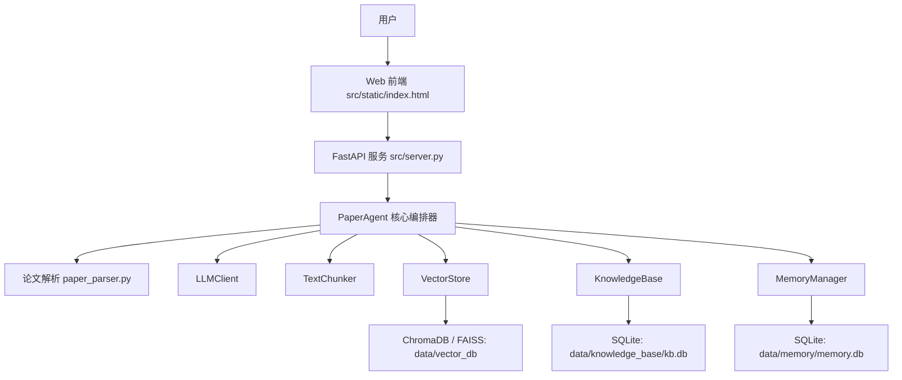

# PaperAgent

面向科研阅读场景的 Agentic RAG 论文拆解与知识库助手。系统支持论文上传、结构化拆解、本地知识库管理、向量检索问答、多轮会话记忆和 Web 可视化交互。

## 项目状态

- [✅] Proposal
- [✅] MVP
- [✅] Final

## 项目背景

研究生和科研人员在阅读论文时通常需要反复提取研究问题、方法、贡献、实验结论和局限性。传统文献管理工具主要解决“存文件”和“管引用”的问题，但难以沉淀论文内容，也不擅长跨论文问答和对比分析。PaperAgent 通过 LLM、RAG、向量数据库和长期记忆机制，把论文阅读流程转化为可复用、可检索、可追问的智能知识库。

## 核心功能

- 论文拆解：支持 PDF、TXT、Markdown 文件上传，自动提取文本并调用 LLM 生成结构化分析结果。
- 知识库管理：保存论文标题、作者、摘要、关键词、拆解 JSON、知识块和分类信息。
- Agentic RAG 问答：基于 ChromaDB / FAISS 进行语义检索，将相关片段作为上下文交给 LLM 生成回答。
- 来源追踪：RAG 回答返回检索片段和相似度，便于检查回答依据。
- 长期记忆：保存会话、消息、关键方法和关键词记忆，支持跨会话沉淀。
- 分类管理：支持创建、编辑、删除论文分类，并按分类过滤检索范围。
- 批量处理：支持批量上传论文或对指定目录下的论文进行批处理。
- Web 交互：提供浏览器界面，支持论文管理、对话、RAG 模式、历史会话和结果展示。
- 样例数据：提供 `sample_data/papers/` 和初始化脚本，便于快速复现 RAG Demo。

## 技术栈

| 类型 | 技术 |
|---|---|
| 后端框架 | FastAPI, Uvicorn |
| LLM 接口 | OpenAI-compatible API, DeepSeek / SiliconFlow 等兼容模型 |
| Agent 编排 | 自定义 PaperAgent 核心循环 |
| RAG 检索 | ChromaDB, FAISS 可选 |
| Embedding | ChromaDB 默认嵌入、本地 sentence-transformers 或 OpenAI-compatible Embedding |
| 数据存储 | SQLite |
| 文件解析 | PyPDF2, pdfplumber / PyMuPDF 备用 |
| 前端 | HTML, CSS, JavaScript 单页应用 |
| 配置管理 | python-dotenv, 环境变量 |

## 系统架构



## 目录结构

```text
cs599-project/
├── docs/                         # 项目文档
│   ├── Product_Spec.md
│   ├── Architecture_Spec.md
│   ├── API_Spec.md
│   ├── architecture.md
│   ├── demo_screenshots/
│   └── CS599_大作业报告.pdf        # 最终报告 PDF，完成后放入此处
├── sample_data/                  # 可提交的演示数据
│   └── papers/
├── scripts/
│   └── init_demo_data.py          # 初始化样例论文索引
├── src/                          # 项目源代码
│   ├── agent/
│   ├── knowledge_base/
│   ├── memory/
│   ├── static/
│   ├── config.py
│   ├── main.py
│   └── server.py
├── README.md                     # 项目入口
├── requirements.txt
├── .env.example                  # 环境变量示例
├── .gitignore
└── LICENSE
```

运行时会在仓库根目录自动生成 `data/`，用于保存 SQLite 数据库和向量数据库。`data/` 属于本地运行数据，默认不提交；可通过 `sample_data/` 和初始化脚本复现演示数据。

## 快速开始

### 1. 创建虚拟环境

```bash
cd cs599-project
python3 -m venv .venv
source .venv/bin/activate
```

Windows PowerShell:

```powershell
cd cs599-project
python -m venv .venv
.\.venv\Scripts\Activate.ps1
```

### 2. 安装依赖

```bash
pip install -r requirements.txt
```

### 3. 配置环境变量

```bash
cp .env.example .env
```

编辑 `.env`，填入自己的模型服务配置：

```env
LLM_API_KEY=your_api_key_here
LLM_BASE_URL=https://api.siliconflow.cn/v1
LLM_MODEL=deepseek-ai/DeepSeek-V3.2
VECTOR_DB_TYPE=chroma
EMBED_METHOD=chroma
```

注意：`.env` 保存真实 API Key，已经被 `.gitignore` 忽略

### 4. 初始化样例数据

该步骤不调用 LLM，只会把 `sample_data/papers/` 中的 Markdown 样例写入本地知识库和向量库。

```bash
python scripts/init_demo_data.py
```

### 5. 启动 Web 服务

```bash
python src/server.py
```

浏览器访问：

```text
http://localhost:8000
```

### 6. 使用命令行模式

```bash
python src/main.py
```

常用命令：

```text
decompose ./sample_data/papers/agentic_rag_demo.md
query Agentic RAG 的主要贡献是什么
chat 帮我总结一下知识库里的论文方向
papers
sessions
memories
stats
```

## 环境变量

| 变量名 | 必填 | 默认值 | 说明 |
|---|---|---|---|
| `LLM_API_KEY` | 是 | 无 | LLM API Key |
| `LLM_BASE_URL` | 否 | `https://api.siliconflow.cn/v1` | OpenAI-compatible API 地址 |
| `LLM_MODEL` | 否 | `deepseek-ai/DeepSeek-V3.2` | 使用的对话模型 |
| `VECTOR_DB_TYPE` | 否 | `chroma` | 向量数据库类型，支持 `chroma` / `faiss` |
| `EMBED_METHOD` | 否 | `chroma` | Embedding 方法，支持 `chroma` / `local` / `openai` |
| `EMBED_MODEL` | 否 | `paraphrase-multilingual-MiniLM-L12-v2` | 本地 Embedding 模型 |
| `CHUNK_SIZE` | 否 | `500` | 文本分块大小 |
| `CHUNK_OVERLAP` | 否 | `100` | 相邻文本块重叠长度 |
| `RAG_TOP_K` | 否 | `5` | RAG 检索返回片段数量 |

## API 简表

| 接口 | 方法 | 功能 |
|---|---|---|
| `/` | GET | Web 首页 |
| `/api/decompose` | POST | 上传并拆解单篇论文 |
| `/api/batch-decompose` | POST | 批量上传并拆解论文 |
| `/api/index` | POST | 为单篇论文建立 RAG 索引 |
| `/api/chat` | POST | 普通对话或 RAG 问答 |
| `/api/search` | GET | 搜索知识库 |
| `/api/papers` | GET | 获取论文列表 |
| `/api/categories` | GET/POST | 查询或创建分类 |
| `/api/sessions` | GET/POST | 查询或创建会话 |
| `/api/memories` | GET | 获取长期记忆 |
| `/api/stats` | GET | 获取知识库统计信息 |


