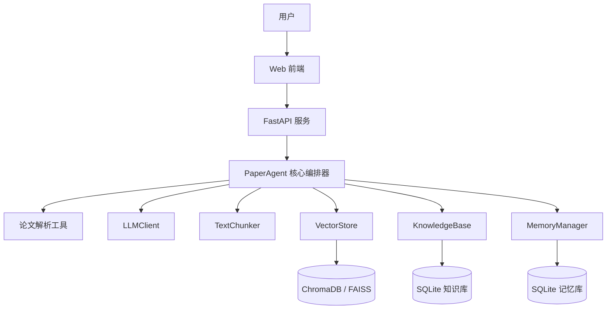

# Architecture Spec

## 总体架构

## 核心模块

- `src/agent/paper_agent.py`：Agent 核心编排、论文拆解、RAG 查询、会话状态管理。
- `src/agent/paper_parser.py`：PDF/TXT/MD 文本提取与预处理。
- `src/knowledge_base/`：知识库、文本分块、向量化和向量存储。
- `src/memory/`：会话、消息、长期记忆和用户偏好。
- `src/server.py`：FastAPI 服务层。
- `src/static/index.html`：Web 前端。

## 数据流

1. 用户上传论文。
2. 系统提取并清洗文本。
3. LLM 生成结构化拆解结果。
4. SQLite 保存论文元数据和拆解结果。
5. 文本块写入向量库。
6. 用户问题通过 RAG 检索相关片段。
7. LLM 基于检索上下文生成回答并返回来源。
